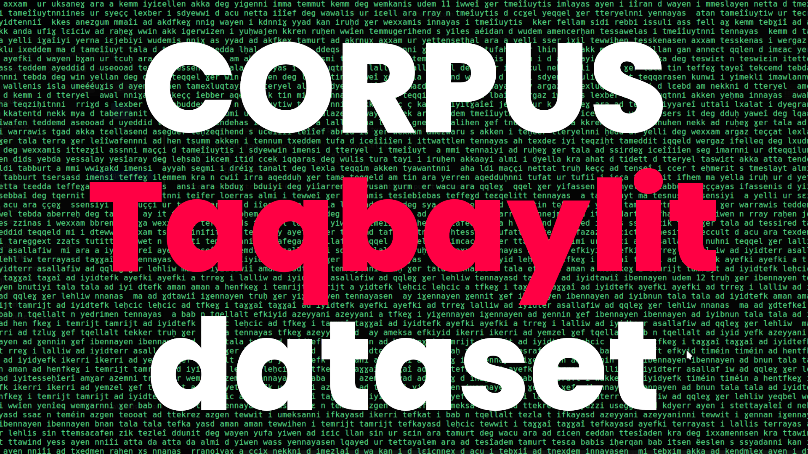

# Dataset de Corpus de Texte en Langue Taqbaylit

Ce projet contient un dataset de corpus de texte en langue Taqbaylit, une langue berbère parlée principalement en Kabylie, une région montagneuse au nord de l'Algérie. Ce corpus est destiné à faciliter la recherche et le développement dans le domaine du traitement automatique des langues pour la langue kabyle.

## Contenu du Projet

- **corpus/** : Ce répertoire contient les fichiers du corpus de texte en langue kabyle.
- **Small Corpus** : [1_SmallCorpusKabyle.txt](corpus/1_SmallCorpusKabyle.txt)
- **Meduim Corpus** :[2_MeduimCorpusKabyle.txt](corpus/2_MeduimCorpusKabyle.txt)
- **Big Corpus** : [3_bigCorpusKabyle.txt](corpus/3_bigCorpusKabyle.txt)
- **Giga Corpus** :[4_gigaCorpusKabyle.txt](corpus/4_gigaCorpusKabyle.txt)

## Exemples d'utilisation

Le dataset peut être utilisé pour :

- Entraîner des modèles de traitement du langage naturel (NLP) pour la langue kabyle, tels que la classification de texte, l'analyse de sentiment, etc.
- Effectuer des analyses linguistiques et sociolinguistiques sur le texte en langue Taqbaylit.
- Développer des applications basées sur le NLP pour la communauté kabyle.

## Prérequis

Aucun prérequis spécifique n'est nécessaire pour utiliser ce dataset, simplement un environnement Python avec les bibliothèques standard pour le traitement du langage naturel.

## Comment Utiliser

1. **Téléchargement du Dataset** :
   - Clonez ce référentiel sur votre machine locale en utilisant la commande suivante :
     ```
     git clone https://github.com/aitTalla/kabyle-corpus-dataset
     ```

2. **Exploration du Dataset** :
   - Explorez les fichiers dans le répertoire `corpus/` pour accéder aux textes en langue kabyle.

3. **Intégration dans Vos Projets** :
   - Utilisez les données pour entraîner des modèles NLP personnalisés ou pour des analyses linguistiques spécifiques à la langue kabyle.

## Contribution

Les contributions sous forme de suggestions, de corrections ou d'ajouts de nouveaux textes en langue kabyle sont les bienvenues. Veuillez soumettre une pull request expliquant clairement les changements proposés.

## Licence

Ce projet est sous licence MIT - voir le fichier [LICENSE](LICENSE) pour plus de détails.
